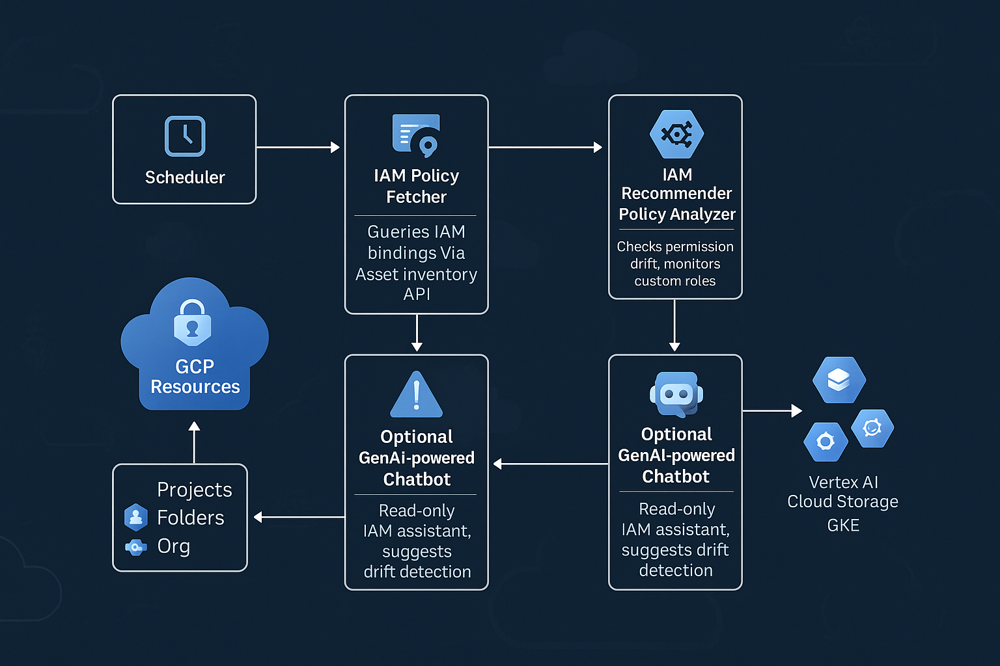

# GCP IAM Audit Chatbot - Publicis Sapient POC

[](https://github.com)
[](https://terraform.io)
[](https://opensource.org/licenses/MIT)

This project delivers a GenAI-powered IAM Audit Chatbot that helps security teams identify and respond to risky IAM configurations across GCP.

---

## 🎯 Key Features

- 🔎 Analyzes GCP **custom IAM roles**
- 🚨 Detects **risky or unused permissions**
- 📁 Logs detailed audit reports to **Cloud Storage**
- 💬 Sends alerts via **Microsoft Teams** and **Email (SendGrid)**
- 🧠 (Optional) Enables **GenAI-based IAM Q&A** via Vertex AI
- 🔄 Integrated CI/CD via **GitHub Actions**, optional Jenkins
- 🔐 Uses **Secret Manager** to secure credentials

---

## 📊 Architecture Overview



---

## 🔧 Project Components

### 🏗️ Infrastructure (Terraform)
- `main.tf`: Deploys Cloud Run service
- `variables.tf`: Defines deployment variables (e.g., region, image)
- `secrets.tf`: Configures Secret Manager entries for Teams and SendGrid
- `outputs.tf`: Outputs the Cloud Run URL after deployment
- `terraform.tfvars`: Stores environment-specific values

### 🔁 CI/CD Workflows
- `.github/workflows/deploy.yaml`: GitHub Actions CI/CD pipeline
- `Jenkinsfile`: Alternative Jenkins pipeline (with MS Teams approval)

### 🧪 Application Source
- `iam_audit_tool_with_teams.py`: Python-based IAM audit logic
- `requirements.txt`: Python dependencies

### 🛠️ Scripts
- `rollback.sh`: Shell script to rollback to a previous Docker image version via `gcloud run deploy`

---

## 🚀 Deployment Guide

```bash
# Setup Terraform backend
terraform init

# Deploy to staging environment
terraform apply -var-file="terraform.tfvars"

# (Optional) Deploy to production using a different var file
terraform apply -var-file="prod.tfvars"


